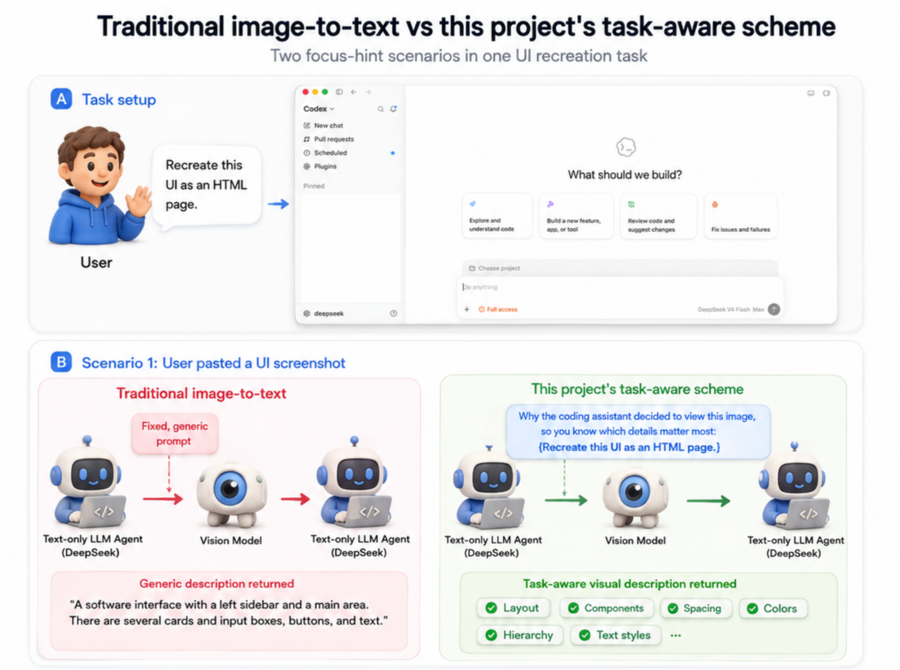
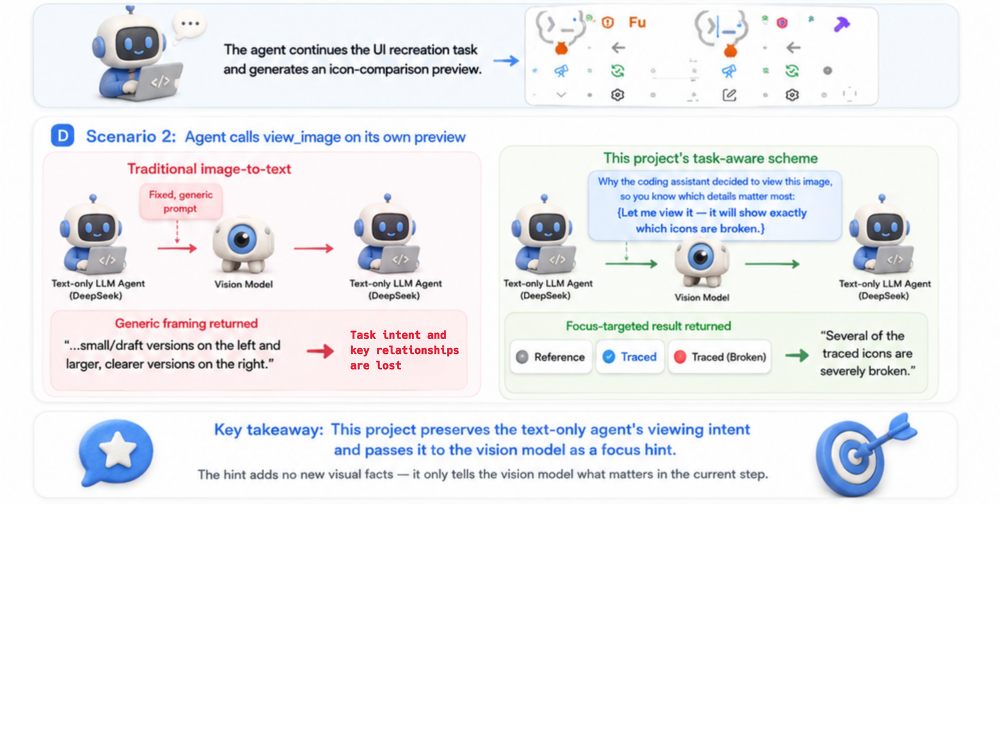

<div align="center">

# agent-vision-toolkit

[](https://github.com/Anionex/agent-vision-toolkit/stargazers)
[](https://github.com/Anionex/agent-vision-toolkit/forks)
[](https://github.com/Anionex/agent-vision-toolkit/blob/main/LICENSE)

[](https://agentskills.io)
[](https://github.com/Anionex/agent-vision-toolkit/tree/main/extensions)
[](https://github.com/Anionex/agent-vision-toolkit/tree/main/bin)

**What it thinks is what it sees — give any text-only coding agent eyes: image Q&A, OCR, screenshot understanding, visual grounding, and image-to-SVG, as a vision toolkit plus a skill, with optional drop-in integration for Codex, Claude Code, Pi, Oh My Pi, and OpenCode.**

🌐 [**中文**](README_CN.md) ｜ **English**

</div>

If your coding agent runs on a text-only model like DeepSeek V4, it can't look at images — screenshots, mockups, diagrams, and error dialogs are all dead ends. This repository gives it eyes in two layers:

1. **The toolkit** — four CLIs, plus a skill that teaches your agent when to reach for each one. Works in any agent with a shell.
2. **Seamless integration** *(optional upgrade)* — a transparent local proxy and single-file native extensions, so **pasted images and built-in image tools work too**, with no tool call and no extra prompting.

All code has been verified in real Codex + DeepSeek sessions, and the same pipeline has been live-verified end-to-end in Claude Code, Pi, Oh My Pi, and OpenCode.

> If this project helps you, feel free to star🌟 & fork.


## Use-case Playbooks

Beyond giving an agent tools, the included `vision-tools` skill provides end-to-end playbooks it can follow: when to use each workflow, which tools to call, and how to verify the result.

| Use case | What the agent learns to do |
|---|---|
| [Extract long screenshots, chat histories, and scrolling pages](skills/vision-tools/references/long-screenshot-ocr.md) | Find low-content cut bands, OCR each chunk in order, preserve chat speakers/timestamps/quotes, merge only duplicated overlap, and surface risky boundaries for verification. |
| [Rebuild a UI from a screenshot or design](skills/vision-tools/references/restore-ui.md) | Reuse project components and assets first, then combine code-native UI, extracted visuals, rendered screenshots, and visual comparison to align a page or component. |
| [Restore an icon, logo, illustration, or other graphic](skills/vision-tools/references/restore-graphic.md) | Extract a transparent PNG from the source image, or rebuild an editable/scalable SVG when needed, then verify shape, color, and alpha edges. |
| [Turn a sketch, diagram, or whiteboard into structured code](skills/vision-tools/references/restore-structure.md) | Recover nodes, labels, connections, and directions as editable Mermaid, Graphviz, or another structured representation. |
| [Operate a GUI from screenshots](skills/vision-tools/references/gui.md) | Locate a control, perform one action, capture the screen again, and verify the resulting state before continuing. |
| **More use cases** | Other step-by-step visual-agent playbooks are being added gradually. |


## Real-world Effects

<p align="center">
  
  
</p>

*Left: multi-round image Q&A with `glance`. Right: with `ground`, DeepSeek V4 locates screen elements to play chess autonomously.*

<p align="center">
  
  
</p>

*Left: DeepSeek V4 answers a UI style question with similar-style comparisons. Right: DeepSeek V4 debugs a field-name mismatch from a screenshot.*


## Highlights

- **Descriptions target the current question**: every image gets a focus hint — a pasted image carries its own message's text, an image fetched via `view_image` carries the assistant's stated reason for looking — so the description covers the details this turn actually needs instead of being a generic caption.
- **Pasted images and `view_image` both work**: images pasted directly (`message.content`) and images passed when the model calls `view_image` (`function_call_output.output`) are both understood.
- **Parallel multi-image understanding**: multiple images in one request hit the vision model concurrently — N images cost roughly the latency of 1, no waiting image by image.
- **The vision model only looks, it doesn't reason for you**: it transcribes and describes, leaving the conclusion to your coding model.
- **Coarse to fine**: the first description is a map, not the whole answer — `glance -q` and `ground --region` are the follow-up channel when a detail wasn't covered.
- **Exact geometry stays local**: `trace` never calls a vision API, so numbers come from pixels rather than from a model's confident estimate.
- **More vision tools may be added later**


## Quick Start

**The easiest install: hand it to your agent.** Paste this into your coding agent:

> Read https://github.com/Anionex/agent-vision-toolkit and set it up on this machine: the vision toolkit and skill, plus the seamless integration per AGENT_INSTALL.md if my host supports it.

The only thing you need to prepare is an OpenAI-compatible vision API (key, base URL, model name) — the agent does the rest.

<details>
<summary><b>Prefer to install by hand?</b> Three steps.</summary>

**1. Point it at a vision API** — three env vars in `~/.config/agent-vision-toolkit/env` (`chmod 600`):

```bash
VISION_API_KEY=sk-...
VISION_BASE_URL=https://openrouter.ai/api/v1
VISION_MODEL=google/gemini-3.6-flash
```

Any OpenAI-compatible endpoint that supports `/chat/completions` with `image_url` works (e.g. Aliyun DashScope: `https://dashscope.aliyuncs.com/compatible-mode/v1` + `qwen-vl-max-latest`). Add `LANG=en` for English descriptions (default is Chinese).

**2. Put the CLIs on your PATH:**

```bash
git clone https://github.com/Anionex/agent-vision-toolkit.git
export PATH="$PWD/agent-vision-toolkit/bin:$PATH"   # add to your shell profile to persist
```

`glance` needs nothing beyond Python 3.11+; `ground`/`detect`/`crop` and the long-screenshot OCR playbook need `pillow`, while `trace` needs `vtracer` — install those into an isolated venv only if you want those tools.

**3. Install the skill** so your agent knows the tools exist and how to combine them:

```bash
npx skills add Anionex/agent-vision-toolkit --skill vision-tools -a codex -g --copy -y
```

Or copy `skills/vision-tools/` into your agent's skills directory (e.g. `~/.codex/skills/`) and restart the agent.

</details>

## The Tools

Each tool answers one kind of question, so the calling agent — which holds the full context — picks the right one instead of guessing at a single overloaded command.

### `glance` — "what does it show?"

Ask a question about an image directly, or transcribe its text.

```bash
glance screenshot.png -q "What is the dominant color of this image?"
glance screenshot.png --ocr
```

```
The dominant colors of this image are **white and light gray, with light blue accents.**
```

```
Username
Password
Login
```

For a scrolling screenshot or chat history, the skill includes a workflow that
finds safe cut bands, OCRs the chunks with `glance`, merges overlap, and writes
a boundary audit:

```bash
python3 skills/vision-tools/scripts/long_screenshot_ocr.py long-chat.png --mode chat -o long-chat.ocr.md
```

### `ground` — "where is X?"

Locate an object or region and get a bounding box in original pixel coordinates:

```bash
ground screenshot.png "Send button"
```

```
x1: 1067, y1: 841, x2: 1108, y2: 881
```

It analyzes one full image per call. With `--region X1,Y1,X2,Y2` it searches only that box and still reports original-image coordinates — the zoom-in path for small targets.

### `detect` — "what's here?"

Inventory the elements of an image (or a region) — a numbered list with exact visible text and pixel boxes:

```bash
detect page.png
detect page.png "buttons"
detect page.png --region 238,600,953,671
```

```
1. bottom-left Do anything x1: 253, y1: 601, x2: 328, y2: 609
2. bottom-left + x1: 254, y1: 650, x2: 268, y2: 665
3. bottom-right stop button x1: 924, y1: 645, x2: 952, y2: 670
```

A full-screen pass is a fast first draft; for completeness on dense screens, inventory region by region.

### `trace` — "what's the exact shape?"

`trace` vectorizes an image (or a cropped region) into SVG **locally and deterministically** — coordinates come from the actual pixels, not from a vision model's estimates. Use it for exact shape geometry: reproducing icons/logos as SVG, reading a diagram's layout, or measuring elements. Requires the optional `vtracer` (and `pillow` for `--region`).

```bash
trace diagram.png --polygon
trace screenshot.png --region 1563,514,1668,621 -o icon.svg
```

### `crop` — "cut that box out"

`crop` cuts a pixel box out of an image into its own file — the same
X1,Y1,X2,Y2 coordinates `ground`/`detect` print, clamped to the image
bounds. Once the same box is about to feed several checks (pixel_diff,
dominant_colors, trace), cut it once and reuse the file instead of
re-cropping in memory on every call. Requires the optional `pillow`.

```bash
crop screenshot.png --region 1563,514,1668,621 -o send-button.png
```


## Upgrade: Seamless Integration

The toolkit covers everything your agent decides to look at. It cannot cover images the **user pastes** — those reach the model before any tool can run. That gap is what this layer closes: images become text on the wire, so pasting a screenshot just works, and the agent's built-in image tool (`view_image`, `Read`) stops erroring out.

| Agent | How | Status |
|---|---|---|
| **Codex** | transparent local proxy (Responses API) | ✅ verified |
| **Claude Code** | the same proxy — point `ANTHROPIC_BASE_URL` at it | ✅ verified |
| **Pi / Oh My Pi** | one-file native extension ([`extensions/pi/`](extensions/pi/)) | ✅ verified |
| **OpenCode** | one-file native plugin ([`extensions/opencode/`](extensions/opencode/)) | ✅ verified |
| Any agent with a shell | the toolkit above — no integration needed | ✅ |

All entry points share the same describe layer — the focus hint, the verbatim-transcription contract, the re-query channel note, and the per-(image, prompt) cache — and the same three `VISION_*` env vars.

### Descriptions that keep the task in view

Most vision wrappers simply turn an image into a generic description and leave the text model to recover the original task afterward.

This one preserves **why the agent is looking**. It extracts the viewing intent from the user message or the assistant's stated reason for calling `view_image`, then passes that intent to the vision model as a **focus hint**. The result is a task-aware description that emphasizes what matters for the current step—not a generic "detailed description." Lower cost, higher accuracy, and faster response times.

<p align="center">
  
  
</p>

### Installing it

This layer is also agent-installed — the Quick Start prompt already covers it, and there is deliberately no one-click installer because deployment depends on your machine's actual config. The steps your agent follows are in the **[Agent Installation Guide](AGENT_INSTALL.md)**. After installation and a restart, just paste an image or let the model call its built-in image tool. Pi, Oh My Pi, and OpenCode use the single-file [native extensions](extensions/) instead of the proxy — see the per-host READMEs there.


## How It Works

```text
Codex -> 127.0.0.1:19100 -> your existing text-only upstream
             |
             +-- when the request contains images:
                 focus hint (the user's request, or the assistant's
                 stated reason for calling view_image)
                   -> vision prompt -> text description -> image replaced
```

The vision prompt is not a fixed "describe this image". The proxy attaches a **focus hint** so the description covers what actually matters right now: a pasted image carries the user's request, while an image fetched via `view_image` carries the assistant's own stated reason for looking (falling back to the user text when the tool was called silently). Descriptions are cached per (image, prompt); both hint sources sit in the immutable conversation history, so the same image is described once and then hits the cache on every later turn.

The proxy identifies the request dialect from the body shape alone — OpenAI Responses (Codex) or Anthropic Messages (Claude Code) — so one instance serves both, with no per-host configuration. For Claude Code the two image paths are pastes and `Read` on an image file; the hint policy is the same.

The first model response only asks Codex to call `view_image`. After Codex executes the tool locally, the second request carries the image; the proxy converts image to text on this request path. If the catalog explicitly declares support for `text` only, Codex's handler rejects the tool first, so `image` is appended to the existing entry only in that case.

## Configuration

Only these env vars are required, for both the toolkit and the proxy:

| Variable | Required | Description |
|---|---:|---|
| `VISION_API_KEY` | Yes | API key of the multimodal model |
| `VISION_BASE_URL` | Yes | OpenAI-compatible API base URL |
| `VISION_MODEL` | Yes | Multimodal model name |
| `LANG` | No | Vision model output language: `zh` (Chinese) or `en` (English); default `zh` |

Upstream authentication is still sent by your agent and passed through by the proxy, so there's no need to store it again in the env.

## Prerequisites

- A coding agent already working with a text-only model (e.g. DeepSeek V4)
- Python 3.11+
- An OpenAI-compatible vision API that supports `/chat/completions` and `image_url`

## FAQ

### After pointing `base_url` at the local proxy, does the proxy also need the upstream model's API key?

No. Although the network request to the upstream is sent by the proxy process at `127.0.0.1:19100`, the upstream API key is still placed in the `Authorization` header by Codex per your existing configuration, and the proxy forwards that header unchanged:

```text
Codex (carrying the original Authorization)
  -> 127.0.0.1:19100
  -> text-only upstream (receives Authorization unchanged)
```

So don't modify Codex's existing auth config, and don't store the upstream API key again in the proxy env. The proxy env only needs `VISION_API_KEY`, `VISION_BASE_URL`, and `VISION_MODEL`.

## File Listing

| File | Purpose |
|---|---|
| `bin/glance` | Image description, Q&A, and OCR CLI |
| `ground.py` / `bin/ground` | Image target-grounding CLI |
| `detect.py` / `bin/detect` | Element-inventory CLI (shares the ground machinery) |
| `bin/trace` | Local image-to-SVG tracing CLI (exact shape geometry, no vision API) |
| `bin/crop` | Local region-crop CLI (pixel box to image file, no vision API) |
| `skills/vision-tools/scripts/long_screenshot_ocr.py` | Safe long-screenshot splitting, chunk OCR through `glance`, overlap merge, and boundary audit |
| `skills/vision-tools/` | The skill: tool manual, coarse-to-fine method, per-scenario playbooks |
| `vision_client.py` | Vision API client shared by the proxy and the CLIs |
| `vision_proxy.py` | Local image-rewriting proxy and SSE forwarding |
| `extensions/pi/vision.ts` | Single-file native extension for Pi and Oh My Pi |
| `extensions/opencode/vision.ts` | Single-file native plugin for OpenCode |
| `AGENT_INSTALL.md` | Installation and verification steps for agents |
| `tests/test_image_rewrite_shapes.py` | Tests for image structures, concurrency, caching, and failure behavior |
| `tests/test_anthropic_rewrite.py` | Tests for the Anthropic Messages (Claude Code) rewrite path |
| `tests/test_extensions.mjs` | Tests for the Pi / Oh My Pi / OpenCode extensions (node or bun) |
| `tests/smoke_test_proxy.py` | Tests for proxy pass-through, auth, and streaming protocol |
| `tests/test_vision_client.py` | Vision client retry and `glance` tests |
| `tests/test_ground.py` | `ground` coordinate parsing and shared config tests |
| `tests/test_detect.py` | `detect` inventory and region coordinate-mapping tests |
| `tests/test_long_screenshot_ocr.py` | Long-screenshot splitting, merge, orchestration, and resume tests |

## Limitations

- This is an image-to-text layer; it doesn't hand vision tokens directly to the text model.
- Description quality depends on the configured vision model.
- The proxy's cache lives only inside its process and is cleared on restart.

---

Made by [Anionex](https://github.com/Anionex) with codex
