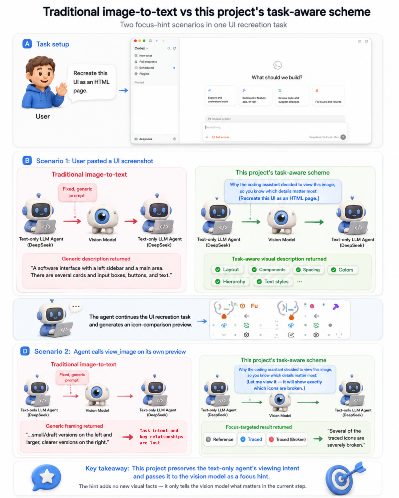
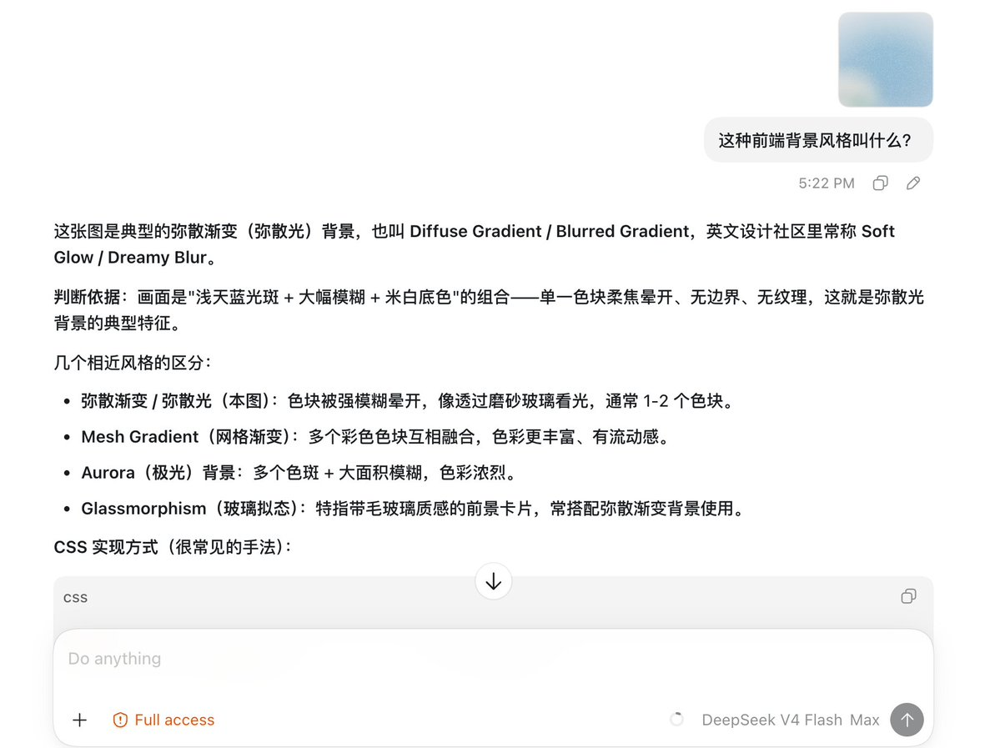
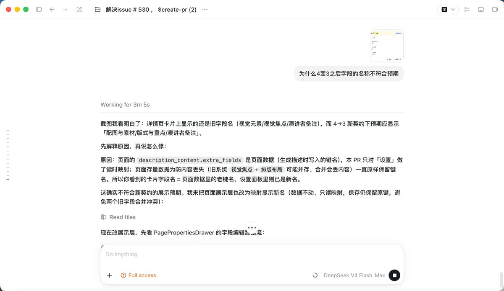
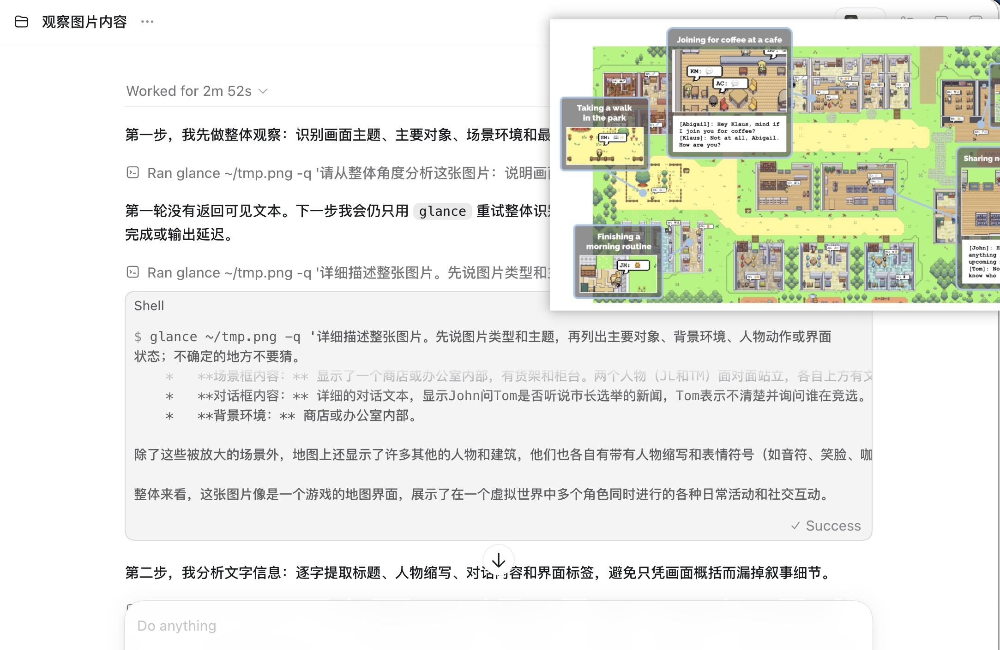
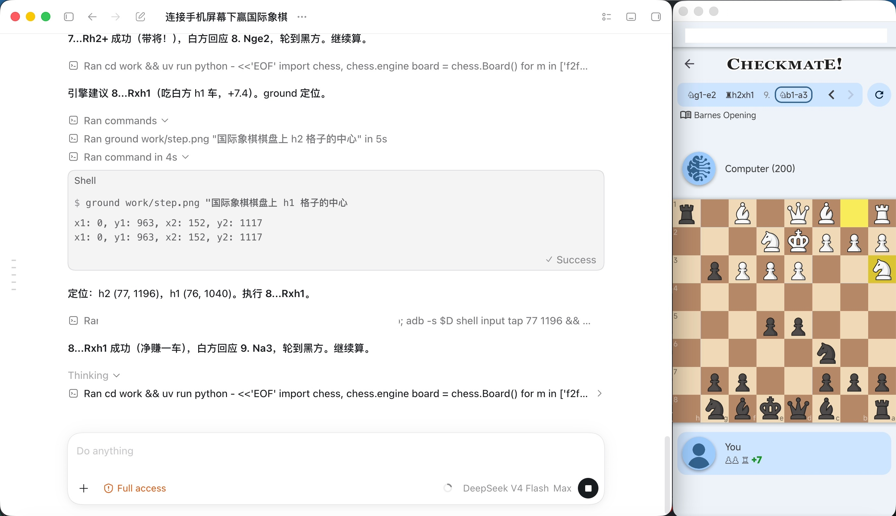

<div align="center">

# codex-vision-proxy

**所想即所见——一个让纯文本模型“用意念”看图的方法和视觉工具包，以及无缝接入 Codex 的现成方案。**

🌐 **中文** ｜ [**English**](README.md)

</div>

如果你的 Codex 已经接入 DeepSeek ，却烦恼于模型没有多模态，不能看图、每次调用看图都会被系统拦下，本仓库提供了一种方式，可以在不引入额外mcp、skills、cli的情况下，让纯文本模型调用codex内置view image的时候不报错，而是给出一段由 agent 看图动机塑造的、贴合当前任务的描述，尽量让纯文本模型的交互体验和多模态模型的交互体验保持一致，免去反复配置的风险。同时也提供可选的视觉工具包，利用多模态模型的能力完成图片问答、ocr、视觉定位等操作。

所有代码均已在真实 Codex + DeepSeek 会话中验证过。可用场景包括但不限于：图片问答，截图分析，Computer Use GUI界面操作，多步图像推理

大多数视觉转接方案只是把图片变成一段通用描述，之后再让纯文本模型自己去把原本的任务找回来。

`codex-vision-proxy` 保留的是 **agent 为什么要看这张图**。它从用户消息、或模型调用 `view_image` 时自述的理由中提取出看图动机，再把这个动机作为 **focus hint** 一并交给视觉模型。拿回来的是一段贴合任务的描述，突出当前这一步真正要紧的内容，而不是一段通用的“详细描述”。

<p align="center">
  
</p>

如果你正在用的 agent 不是 Codex，也可以尝试一下安装项目里的 [visual toolkit](#安装-vision-tools-skill可选)，提供了 cli 让 agent 与图片交互

> 如果项目对你有用，欢迎 star🌟 & follow～，我会分享更多的实用工具和技巧
> 

## 实际效果

<p align="center">
  
  
</p>

*左：DeepSeek V4 回答 UI 背景风格问题并对比相近风格；右：DeepSeek V4 根据截图排查字段名称不符预期的 bug。*

<p align="center">
  
  
</p>

*左：安装可选 `glance` 后的多轮图片问答；右：安装 `ground` 后，DeepSeek V4 定位屏幕视觉元素，自主游玩国际象棋。*

## 亮点

- **描述围绕当前问题展开**：每张图都会附上 focus hint，贴图用它自己那条消息的文字，`view_image` 取回的图用模型自述的看图动机，描述因此覆盖这一轮真正要用到的细节，而不是一段通用 caption。
- **视觉模型只负责看，不替你推理**：它只转写和描述图片内容，不直接回答问题，结论仍由你的编程模型基于描述得出。
- **贴图和 `view_image` 都支持**：直接粘贴图片（`message.content`）和模型调用 `view_image`（`function_call_output.output`）两种结构都能看图
- **多图并行看图**：一次请求里的多张图并发调用视觉模型，N 张图约等于 1 张图的延迟，不必逐张等待。
- **同图只调一次**：按（图片, prompt）缓存描述，两种 hint 都取自不可变的对话历史，组合稳定复现，多步任务的后续每轮都命中缓存，近乎零延迟。
- **可选 `glance`**：简洁的独立 CLI，图片问答和 OCR——描述里缺了你要的细节时，用它追问补充。
- **可选 `ground`**：用自然语言定位图片中的目标，输出原图像素坐标下的边界框——用于 GUI 自动化点击和局部放大裁剪。
- **可选 `detect`**：一次调用盘点整屏或区域内的元素清单——从截图还原 UI 时的脚手架。
- **可选 `trace`**：本地确定性图转 SVG 描摹，不经过视觉 API——用于把图标/图形还原成矢量、精确测量形状几何。
- **后续可能加入的更多视觉工具** 

## 使用方式

本仓库不提供通用一键安装器。推荐把仓库链接交给 Codex Agent：

> 我已经在 Codex 中接入并可正常使用 DeepSeek。请先阅读这个仓库的 README，再按照 AGENT_INSTALL.md 根据当前系统部署并验证 `view_image`。

详细执行步骤见 **[Codex Agent 安装说明](AGENT_INSTALL.md)**。安装完成并重启 Codex 后，直接粘贴图片或让 DeepSeek 调用内置 `view_image` 即可。

## 前置条件

- 已可正常使用 DeepSeek 的 Codex
- Python 3.11+
- 一个支持 `/chat/completions` 与 `image_url` 的 OpenAI-compatible 视觉 API

## 配置

env 只需配置：

| 变量 | 必需 | 说明 |
|---|---:|---|
| `VISION_API_KEY` | 是 | 多模态模型的 API key |
| `VISION_BASE_URL` | 是 | OpenAI-compatible API 地址 |
| `VISION_MODEL` | 是 | 多模态模型名 |
| `LANG` | 否 | 视觉模型输出语言：`zh`=中文，`en`=English（默认 `zh`） |

DeepSeek 的认证继续由 Codex 发送并由代理透传，不需要在 env 中重复保存。

## 可选工具：glance 

`glance` 是独立cli工具。它用于直接对图片发起提问，补充特定细节。

需要全局命令时，可让 Codex 按照安装说明创建 wrapper。得到更简洁的调用形式如下：

```bash
glance screenshot.png -q "这张图片的主色调是什么？"
glance screenshot.png --ocr 
```

回答：
```
这张图片的主色调为**白色和浅灰色，局部带淡蓝色。**
```

```
用户名
密码
登录
```

## 可选工具：ground

`ground` 是独立cli工具，用于定位图片中的对象或区域：

```bash
ground screenshot.png "发送按钮"
```

```
x1: 1067, y1: 841, x2: 1108, y2: 881
```

每次只分析一张完整图片，并输出目标在原图中的像素坐标。加 `--region X1,Y1,X2,Y2` 可只在该框内查找，输出仍是原图坐标。

## 可选工具：detect

`detect` 是独立 CLI，盘点图片（或指定区域）中的元素——输出编号清单，带逐字可见文字和像素框：

```bash
detect page.png
detect page.png "buttons"
detect page.png --region 238,600,953,671
```

```
1. bottom-left Do anything x1: 253, y1: 601, x2: 328, y2: 609
2. bottom-left + x1: 254, y1: 650, x2: 268, y2: 665
3. bottom-right stop button x1: 924, y1: 645, x2: 952, y2: 670
```

整屏一遍是快速初稿；密集页面要完整清单时，按区域逐块盘点。

## 可选工具：trace

`trace` 在**本地确定性地**把图片（或裁剪区域）矢量化为 SVG——坐标来自真实像素，不是视觉模型的估计。用于精确形状几何：图标/logo 还原为 SVG、读取示意图布局、测量元素尺寸。需要可选依赖 `vtracer`（`--region` 另需 `pillow`）。

```bash
trace diagram.png --polygon
trace screenshot.png --region 1563,514,1668,621 -o icon.svg
```

## 安装 vision-tools skill（可选）

安装额外视觉工具包的方式之一，是安装仓库内附带的 `vision-tools` skill：它告诉 Codex `glance`/`ground` 是什么以及怎么用。使用官方 skills CLI 安装：

```bash
npx skills add Anionex/codex-vision-proxy --skill vision-tools -a codex -g --copy -y
```

也可以手动复制：

```bash
cp -r skills/vision-tools ~/.codex/skills/
```

之后重启 Codex 生效。

## 工作原理

```text
Codex -> 127.0.0.1:19100 -> 用户原有的 DeepSeek 上游
             |
             +-- 请求含图片时：
                 focus hint（用户的请求，或模型调用 view_image 时自述的动机）
                   -> 视觉 prompt -> 文字描述 -> 替换图片
```

视觉 prompt 不是固定的"请描述这张图"。代理会给视觉模型附上 **focus hint**，让描述围绕当下真正要紧的内容展开：贴图场景用用户的请求做 hint；模型主动调用 `view_image` 的场景，用模型自己说明的看图动机做 hint（没有则回退到用户请求）。描述按（图片, prompt）缓存；两种 hint 都取自不可变的对话历史，同一张图只描述一次，之后每轮都命中缓存。

第一次模型响应只要求 Codex 调用 `view_image`。Codex 在本机执行工具后，第二次请求才携带图片；代理在这个请求方向完成图片转文字。若 catalog 明确声明仅支持 `text`，Codex 的 handler 会先拒绝工具，因此只在这一种情况下给现有条目追加 `image`。

## 常见问题

### `base_url` 指向本地代理后，代理也需要配置 DeepSeek API key 吗？

不需要。访问 DeepSeek 上游的网络请求虽然由 `127.0.0.1:19100` 的代理进程发出，但 DeepSeek API key 仍由 Codex 按原有配置放在 `Authorization` 请求头中，代理会将这个请求头原样转发给 DeepSeek：

```text
Codex（携带原有 Authorization）
  -> 127.0.0.1:19100
  -> DeepSeek 上游（原样收到 Authorization）
```

因此不要修改 Codex 原有的认证配置，也不要在代理 env 中重复保存 `DEEPSEEK_API_KEY`。代理 env 只需配置 `VISION_API_KEY`、`VISION_BASE_URL` 和 `VISION_MODEL`。

## 文件清单

| 文件 | 作用 |
|---|---|
| `codex-vision-proxy.py` | 本地图片改写代理与 SSE 转发 |
| `vision_client.py` | 代理与 `glance` 共用的视觉 API 客户端 |
| `bin/glance` | 可选的图片描述、问答和 OCR CLI |
| `ground.py` / `bin/ground` | 可选的图片目标定位 CLI |
| `detect.py` / `bin/detect` | 可选的元素盘点 CLI（与 ground 共用实现） |
| `bin/trace` | 可选的本地图转 SVG 描摹 CLI（精确形状几何，不调视觉 API） |
| `AGENT_INSTALL.md` | Codex Agent 的安装与验证步骤 |
| `tests/test_image_rewrite_shapes.py` | 图片结构、并发、缓存及失败行为测试 |
| `tests/smoke_test_proxy.py` | 代理透传、鉴权和流式协议测试 |
| `tests/test_vision_client.py` | 视觉客户端重试与 `glance` 测试 |
| `tests/test_ground.py` | `ground` 坐标解析和共享配置测试 |

## 限制

- 这是图片转文字代理，不会把视觉 token 直接交给 DeepSeek。
- 图片描述质量取决于所配置的视觉模型。
- 缓存只存在于代理进程内，重启后清空。


---
Made by [Anionex](https://github.com/Anionex) with codex
