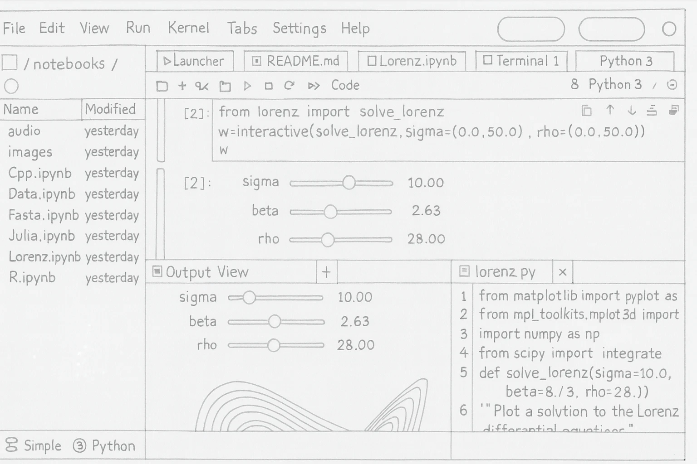
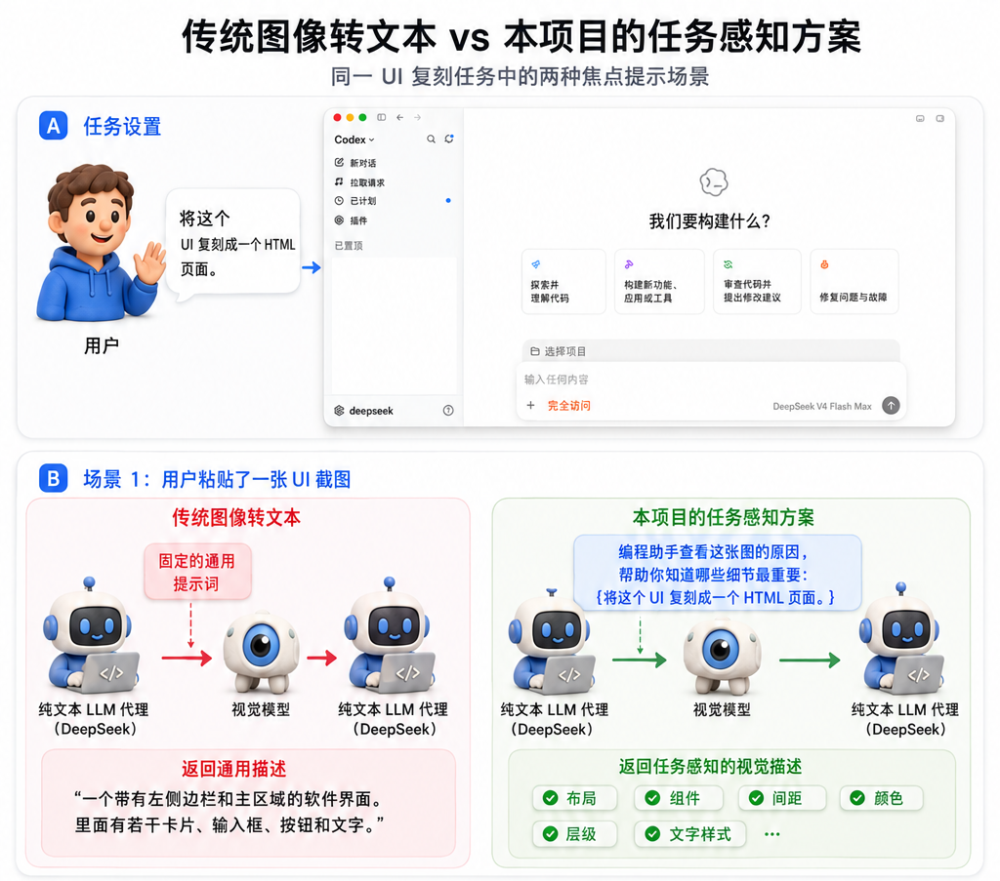

<div align="center">

# agent-vision-toolkit

[](https://github.com/Anionex/agent-vision-toolkit/stargazers)
[](https://github.com/Anionex/agent-vision-toolkit/forks)
[](https://github.com/Anionex/agent-vision-toolkit/blob/main/LICENSE)

[](https://agentskills.io)
[](https://github.com/Anionex/agent-vision-toolkit/tree/main/extensions)
[](https://github.com/Anionex/agent-vision-toolkit/tree/main/bin)

**所想即所见——给任意纯文本 coding agent 装上眼睛：图片问答、OCR、截图分析、视觉定位、图转 SVG，一套视觉工具箱加一个 skill，并可选无缝接入 Codex、Claude Code、Pi、Oh My Pi、OpenCode。**

🌐 **中文** ｜ [**English**](README.md)

</div>

如果你的 coding agent 接的是 DeepSeek V4 这类纯文本模型，它就没法看图——截图、设计稿、示意图、报错弹窗全是死路。本仓库分两层给它装上眼睛：

1. **工具箱** —— 四个 CLI，外加一个 skill 告诉 agent 什么时候该用哪个。任何有 shell 的 agent 都能用。
2. **无缝接入**（可选升级）—— 透明本地代理与单文件原生 extension，让**用户粘贴的图片和 agent 内置看图工具也能工作**，不需要额外的工具调用，也不需要额外提示词。

所有代码均已在真实 Codex + DeepSeek 会话中验证过，同一套管线也在 Claude Code、Pi、Oh My Pi、OpenCode 中完成了真机端到端验证。

> 如果项目对你有用，欢迎 star🌟 & fork。


## 用例技能

除了给 agent 提供看图工具，随项目提供的 `vision-tools` skill 还内置了可直接照着执行的完整用例：什么时候使用、按什么顺序调用工具、最后如何验收，都写在对应的 playbook 里。

| 用例 | Agent 会如何完成 |
|---|---|
| [识别长截图、聊天记录与滚动页面](skills/vision-tools/references/long-screenshot-ocr.md) | 避开文字寻找安全切口，按顺序逐块 OCR，保留聊天发言人、时间和引用关系，只合并确实重复的内容，并标出需要复查的边界。 |
| [根据截图或设计稿还原 UI](skills/vision-tools/references/restore-ui.md) | 优先复用项目已有组件和素材，再结合原生 UI 代码、截图素材、渲染截图与视觉对比，逐轮对齐页面或组件。 |
| [还原图标、Logo、插画等图形素材](skills/vision-tools/references/restore-graphic.md) | 从原图提取透明 PNG；需要可编辑或无损缩放时重建 SVG，并验证形状、颜色和透明边缘。 |
| [把草图、示意图或白板转成结构化代码](skills/vision-tools/references/restore-structure.md) | 识别节点、文字、连线与方向，输出可编辑的 Mermaid、Graphviz 或其他结构化表示。 |
| [根据截图操作 GUI](skills/vision-tools/references/gui.md) | 定位控件、执行一次操作、重新截图并验证结果，再继续下一步，避免在过期截图上连续操作。 |
| **更多用例** | 其他可让 agent 直接照着执行的视觉任务用例正在逐步加入。 |


## 实际效果

### UI 还原：从手绘稿到成品界面

<p align="center">
  
  
</p>

*左：作为输入的手绘参考；右：依据该手绘稿还原出的 JupyterLab 工作区界面。完整流程见 [UI 还原 playbook](skills/vision-tools/references/restore-ui.md)。*

<p align="center">
  
  
</p>

*左：用 `glance` 做多轮图片问答；右：用 `ground` 定位屏幕视觉元素，DeepSeek V4 自主游玩国际象棋。*

<p align="center">
  
  
</p>

*左：DeepSeek V4 回答 UI 背景风格问题并对比相近风格；右：DeepSeek V4 根据截图排查字段名称不符预期的 bug。*


## 亮点

- **不只是看图描述，是获取llm真正关注的内容**：每张图都会附上 focus hint，贴图用它自己那条消息的文字，`view_image` 取回的图用模型自述的看图动机，描述因此覆盖这一轮真正要用到的细节，而不是一段通用 caption。
- **贴图和 `view_image` 都支持**：直接粘贴图片（`message.content`）和模型调用 `view_image`（`function_call_output.output`）两种结构都能看图。
- **多图并行看图**：一次请求里的多张图并发调用视觉模型，N 张图约等于 1 张图的延迟，不必逐张等待。
- **视觉模型只负责看，不替你推理**：它只转写和描述图片内容，不直接回答问题，结论仍由你的编程模型基于描述得出。
- **由粗到细**：首轮描述是地图，不是完整答案——描述里缺了你要的细节时，用 `glance -q` 追问、用 `ground --region` 放大。
- **精确几何留在本地**：`trace` 不经过视觉 API，数字来自真实像素，而不是模型自信的估计。
- **后续可能加入的更多视觉工具**


## 快速开始

**最简单的安装方式：交给你的 agent。** 把这句话发给你的 coding agent：

> 请阅读 https://github.com/Anionex/agent-vision-toolkit ，在本机装好视觉工具箱和 skill；如果我的宿主适用，也按 AGENT_INSTALL.md 部署无缝接入。

你唯一要准备的是一个 OpenAI-compatible 的视觉 API（key、地址、模型名），其余都由 agent 完成。

<details>
<summary><b>想手动装？</b>三步。</summary>

**1. 指向一个视觉 API**——在 `~/.config/agent-vision-toolkit/env` 里写三个环境变量（`chmod 600`）：

```bash
VISION_API_KEY=sk-...
VISION_BASE_URL=https://openrouter.ai/api/v1
VISION_MODEL=google/gemini-3.6-flash
```

任何支持 `/chat/completions` 与 `image_url` 的 OpenAI-compatible 端点都可以（如阿里云百炼：`https://dashscope.aliyuncs.com/compatible-mode/v1` + `qwen-vl-max-latest`）。需要英文描述时加 `LANG=en`（默认中文）。

**2. 把 CLI 放进 PATH：**

```bash
git clone https://github.com/Anionex/agent-vision-toolkit.git
export PATH="$PWD/agent-vision-toolkit/bin:$PATH"   # 写进 shell 配置以持久生效
```

`glance` 只需要 Python 3.11+；`ground`/`detect`/`crop` 和长截图 OCR 用例需要 `pillow`，`trace` 需要 `vtracer`——只在你要用这些工具时，把它们装进一个隔离的 venv。

**3. 安装 skill**，让 agent 知道这些工具的存在以及如何组合使用：

```bash
npx skills add Anionex/agent-vision-toolkit --skill vision-tools -a codex -g --copy -y
```

也可以把 `skills/vision-tools/` 复制到你的 agent 的 skills 目录（如 `~/.codex/skills/`），重启生效。

</details>

## 工具

每个工具回答一类问题，让掌握完整上下文的调用方 agent 去选择，而不是让它对着一个大而全的命令猜参数。

### `glance` —— “图上有什么？”

直接对图片提问，或转写图中的文字。

```bash
glance screenshot.png -q "这张图片的主色调是什么？"
glance screenshot.png --ocr
```

```
这张图片的主色调为**白色和浅灰色，局部带淡蓝色。**
```

```
用户名
密码
登录
```

遇到滚动长截图或聊天记录时，skill 内置的工作流会寻找安全切口，调用
`glance` 逐块 OCR，合并重叠内容，并生成边界复查报告：

```bash
python3 skills/vision-tools/scripts/long_screenshot_ocr.py long-chat.png --mode chat -o long-chat.ocr.md
```

### `ground` —— “X 在哪？”

定位图片中的对象或区域，输出原图像素坐标下的边界框：

```bash
ground screenshot.png "发送按钮"
```

```
x1: 1067, y1: 841, x2: 1108, y2: 881
```

每次分析一张完整图片。加 `--region X1,Y1,X2,Y2` 可只在该框内查找，输出仍是原图坐标——小目标的放大通道。

### `detect` —— “这里有些什么？”

盘点图片（或指定区域）中的元素——输出编号清单，带逐字可见文字和像素框：

```bash
detect page.png
detect page.png "buttons"
detect page.png --region 238,600,953,671
```

```
1. bottom-left Do anything x1: 253, y1: 601, x2: 328, y2: 609
2. bottom-left + x1: 254, y1: 650, x2: 268, y2: 665
3. bottom-right stop button x1: 924, y1: 645, x2: 952, y2: 670
```

整屏一遍是快速初稿；密集页面要完整清单时，按区域逐块盘点。

### `trace` —— “精确形状是什么？”

`trace` 在**本地确定性地**把图片（或裁剪区域）矢量化为 SVG——坐标来自真实像素，不是视觉模型的估计。用于精确形状几何：图标/logo 还原为 SVG、读取示意图布局、测量元素尺寸。需要可选依赖 `vtracer`（`--region` 另需 `pillow`）。

```bash
trace diagram.png --polygon
trace screenshot.png --region 1563,514,1668,621 -o icon.svg
```

### `crop` —— “把这个盒子裁出来”

`crop` 把图片中的像素盒裁成独立文件——就是 `ground`/`detect` 输出的那组
X1,Y1,X2,Y2 坐标，超出图片边界时自动收敛。同一个盒子接下来要喂给
pixel_diff、dominant_colors、trace 多次时，先裁一次存成文件复用，而不是每次
调用都在内存里重裁。需要可选依赖 `pillow`。

```bash
crop screenshot.png --region 1563,514,1668,621 -o send-button.png
```


## 升级：无缝接入

工具箱覆盖了 agent 自己决定要看的一切。它覆盖不了**用户粘贴**的图片——那些图在任何工具运行之前就已经到达模型。这一层补的就是这个缺口：图片在链路上变成文字，粘贴截图直接可用，agent 内置的看图工具（`view_image`、`Read`）也不再报错。

| Agent | 接入方式 | 状态 |
|---|---|---|
| **Codex** | 透明本地代理（Responses API） | ✅ 已验证 |
| **Claude Code** | 同一个代理——把 `ANTHROPIC_BASE_URL` 指向它 | ✅ 已验证 |
| **Pi / Oh My Pi** | 单文件原生 extension（[`extensions/pi/`](extensions/pi/)） | ✅ 已验证 |
| **OpenCode** | 单文件原生 plugin（[`extensions/opencode/`](extensions/opencode/)） | ✅ 已验证 |
| 任何有 shell 的 agent | 上面的工具箱——无需接入 | ✅ |

所有入口共享同一套描述层——focus hint、逐字转写约定、重查 channel note、（图片, prompt）缓存——以及同样的三个 `VISION_*` 环境变量。

### 让描述始终对着当前任务

大多数视觉转接方案只是把图片变成一段通用描述，之后再让纯文本模型自己去把原本的任务找回来。

`agent-vision-toolkit` 保留的是 **agent 为什么要看这张图**。它从用户消息、或模型调用 `view_image` 时自述的理由中提取出看图动机，再把这个动机作为 **focus hint** 一并交给视觉模型。拿回来的是一段贴合任务的描述，突出当前这一步真正要紧的内容，而不是一段通用的“详细描述”。更低成本，更高的准确率，更快的响应速度。

<p align="center">
  
  
</p>

### 怎么装

这一层同样交给 agent 安装——快速开始里那句话已经覆盖了它；本仓库刻意不提供一键安装器，因为部署取决于你这台机器的真实配置。agent 遵循的步骤在 **[Agent 安装说明](AGENT_INSTALL.md)**。安装完成并重启后，直接粘贴图片或让模型调用内置看图工具即可。Pi、Oh My Pi、OpenCode 走的是单文件[原生 extension](extensions/) 而不是代理，见那里各宿主的 README。


## 工作原理

```text
Codex -> 127.0.0.1:19100 -> 用户原有的纯文本模型上游
             |
             +-- 请求含图片时：
                 focus hint（用户的请求，或模型调用 view_image 时自述的动机）
                   -> 视觉 prompt -> 文字描述 -> 替换图片
```

视觉 prompt 不是固定的"请描述这张图"。代理会给视觉模型附上 **focus hint**，让描述围绕当下真正要紧的内容展开：贴图场景用用户的请求做 hint；模型主动调用 `view_image` 的场景，用模型自己说明的看图动机做 hint（没有则回退到用户请求）。描述按（图片, prompt）缓存；两种 hint 都取自不可变的对话历史，同一张图只描述一次，之后每轮都命中缓存。

代理仅凭请求体形态识别方言——OpenAI Responses（Codex）或 Anthropic Messages（Claude Code）——同一个实例同时服务两者，无需按宿主配置。Claude Code 侧的两条图片通道是粘贴图和对图片文件的 `Read`，hint 策略完全相同。

第一次模型响应只要求 Codex 调用 `view_image`。Codex 在本机执行工具后，第二次请求才携带图片；代理在这个请求方向完成图片转文字。若 catalog 明确声明仅支持 `text`，Codex 的 handler 会先拒绝工具，因此只在这一种情况下给现有条目追加 `image`。

## 配置

工具箱与代理都只需要这些环境变量：

| 变量 | 必需 | 说明 |
|---|---:|---|
| `VISION_API_KEY` | 是 | 多模态模型的 API key |
| `VISION_BASE_URL` | 是 | OpenAI-compatible API 地址 |
| `VISION_MODEL` | 是 | 多模态模型名 |
| `LANG` | 否 | 视觉模型输出语言：`zh`=中文，`en`=English（默认 `zh`） |

上游模型的认证继续由 agent 发送并由代理透传，不需要在 env 中重复保存。

## 前置条件

- 已接入纯文本模型（如 DeepSeek V4）并可正常使用的 coding agent
- Python 3.11+
- 一个支持 `/chat/completions` 与 `image_url` 的 OpenAI-compatible 视觉 API

## 常见问题

### `base_url` 指向本地代理后，代理也需要配置上游模型的 API key 吗？

不需要。访问上游的网络请求虽然由 `127.0.0.1:19100` 的代理进程发出，但上游的 API key 仍由 Codex 按原有配置放在 `Authorization` 请求头中，代理会将这个请求头原样转发出去：

```text
Codex（携带原有 Authorization）
  -> 127.0.0.1:19100
  -> 纯文本模型上游（原样收到 Authorization）
```

因此不要修改 Codex 原有的认证配置，也不要在代理 env 中重复保存上游的 API key。代理 env 只需配置 `VISION_API_KEY`、`VISION_BASE_URL` 和 `VISION_MODEL`。

## 文件清单

| 文件 | 作用 |
|---|---|
| `bin/glance` | 图片描述、问答和 OCR CLI |
| `ground.py` / `bin/ground` | 图片目标定位 CLI |
| `detect.py` / `bin/detect` | 元素盘点 CLI（与 ground 共用实现） |
| `bin/trace` | 本地图转 SVG 描摹 CLI（精确形状几何，不调视觉 API） |
| `bin/crop` | 本地区域裁剪 CLI（像素盒转图片文件，不调视觉 API） |
| `skills/vision-tools/scripts/long_screenshot_ocr.py` | 安全切分长截图、调用 `glance` 逐块 OCR、合并重叠内容并生成边界审计 |
| `skills/vision-tools/` | skill：工具手册、由粗到细的方法论、按场景的 playbook |
| `vision_client.py` | 代理与 CLI 共用的视觉 API 客户端 |
| `vision_proxy.py` | 本地图片改写代理与 SSE 转发 |
| `extensions/pi/vision.ts` | Pi 与 Oh My Pi 的单文件原生 extension |
| `extensions/opencode/vision.ts` | OpenCode 的单文件原生 plugin |
| `AGENT_INSTALL.md` | Agent 的安装与验证步骤 |
| `tests/test_image_rewrite_shapes.py` | 图片结构、并发、缓存及失败行为测试 |
| `tests/test_anthropic_rewrite.py` | Anthropic Messages（Claude Code）改写路径测试 |
| `tests/test_extensions.mjs` | Pi / Oh My Pi / OpenCode extension 测试（node 或 bun） |
| `tests/smoke_test_proxy.py` | 代理透传、鉴权和流式协议测试 |
| `tests/test_vision_client.py` | 视觉客户端重试与 `glance` 测试 |
| `tests/test_ground.py` | `ground` 坐标解析和共享配置测试 |
| `tests/test_detect.py` | `detect` 盘点与区域坐标映射测试 |
| `tests/test_long_screenshot_ocr.py` | 长截图切分、合并、调用编排与断点复用测试 |

## 限制

- 这是图片转文字的一层，不会把视觉 token 直接交给纯文本模型。
- 图片描述质量取决于所配置的视觉模型。
- 代理的缓存只存在于进程内，重启后清空。

---
Made by [Anionex](https://github.com/Anionex) with codex
