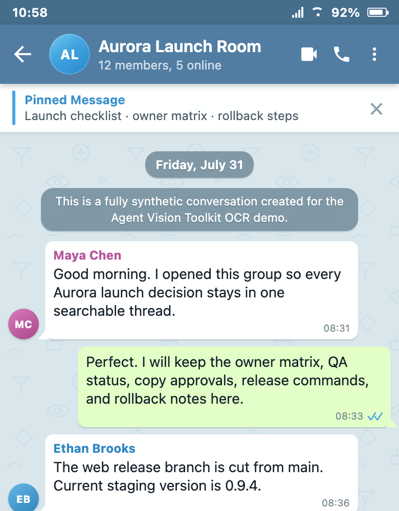

# Synthetic Telegram long-screenshot OCR demo

This fixture is fully synthetic. The names, messages, dates, release details,
filenames, and identifiers were created for this repository; it contains no
real chat export or user data.

<p align="center">
  <a href="telegram-chat-long.png">
    
  </a>
</p>

## Artifacts

| File | Purpose |
|---|---|
| [`telegram-chat.html`](telegram-chat.html) | Deterministic, offline source for the fictional English conversation. |
| [`telegram-chat-long.png`](telegram-chat-long.png) | The generated 780 x 31186 input screenshot. |
| [`telegram-chat-preview.png`](telegram-chat-preview.png) | A compact README preview cropped from the same synthetic screenshot. |
| [`telegram-chat-ocr.md`](telegram-chat-ocr.md) | Merged Markdown transcript produced by the long-screenshot OCR workflow. |

## Checked-in reference run

The reference run on **August 6, 2026** produced the following result:

| Check | Result |
|---|---:|
| Synthetic source records | 180 |
| Extracted records | 180 |
| OCR chunks | 21 |
| Split boundaries | 20 |
| Fallback overlap | 0 px |
| Missing or extra records | **0** |
| Speaker, timestamp, and reply-field differences | **0** |
| Content matches after whitespace/punctuation normalization | **180/180** |
| Presentation-only differences | 4 (2 smart-quote substitutions, 2 blank-line choices) |

The source intentionally uses a much more recognizable Telegram-style mobile
layout: Android status and app bars, a pinned-message banner, doodle wallpaper,
avatars, incoming/outgoing bubble tails, double checks, date and service pills,
an unread divider, replies, reactions, code blocks, files, a poll, a photo card,
and a voice-message card. This exercises safe split selection and structured
chat merging instead of testing only plain paragraph OCR.

## Reproduce

From the repository root, first configure the normal `VISION_*` variables,
then run:

```bash
python3 skills/vision-tools/scripts/long_screenshot_ocr.py \
  examples/long-screenshot-ocr/telegram-chat-long.png \
  --mode chat \
  --chunks-dir work/telegram-chat-ocr \
  --jobs 4 \
  -o work/telegram-chat-ocr.md
```

The chunk directory will contain the 21 images, structured OCR sidecars,
`manifest.json`, and `ocr_audit.md`. Vision-model output can vary, so compare a
new run with the checked-in reference transcript and inspect every boundary the
audit marks for review.

To regenerate the input screenshot from the offline HTML fixture:

```bash
python3 skills/vision-tools/scripts/html_shot.py \
  examples/long-screenshot-ocr/telegram-chat.html \
  --width 390 \
  --height 15593 \
  --scale 2 \
  --wait-ms 100 \
  -o examples/long-screenshot-ocr/telegram-chat-long.png
```
